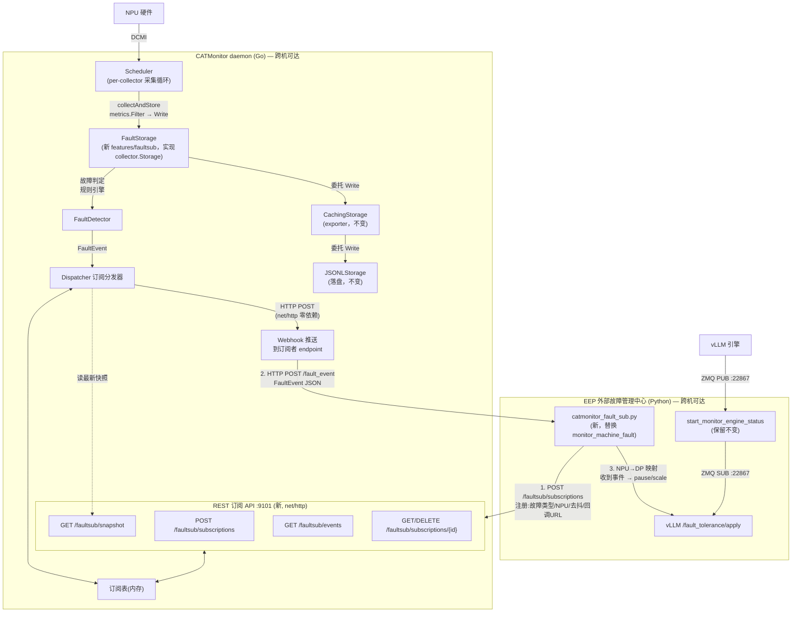

# Elastic EP 与 CATMonitor 整合设计方案 (EEP_combination_DESIGN)

> **文档定位**：本文档描述将 EEP（推理场景卡级弹性容错特性）与底座 CATMonitor 有机整合的设计方案，作为后续编码实现的依据。
>
> **范围**：① 改造 CATMonitor，新增故障信息订阅/推送机制；② 改造 EEP，通过订阅机制从 CATMonitor 及时准确获取故障信息，替代当前自带的 DCMI 轮询 Demo。
>
> **相关代码**：
> - CATMonitor 底座：`CATMonitor/`（Go module `github.com/Computing-Availability-Tools/CATMonitor`）
> - EEP 特性：`feature/elastic-ep/`（Python，vLLM 补丁 + 容错框架 + 外部故障管理中心 demo）
>
> **传输方式（已确认）**：CATMonitor 经 **HTTP Webhook**（`net/http`，无新依赖）主动 POST 故障事件到 EEP 提供的回调 URL；消息体 **JSON**；**支持跨机**部署。EEP 侧起一个轻量 HTTP server 接收。

---

## 1. 背景与目标

### 1.1 现状

- **CATMonitor** 是成熟的全栈指标采集守护进程（Go），已覆盖 CPU/内存/硬盘/GPU/NPU/网卡/机箱共 7 部件、204 个指标。NPU 采集器（`internal/collectors/npu/`）经 DCMI 数据源（`internal/source/dcmi/`）已采集 NPU 健康状态、错误码、ECC、RoCE 链路状态等故障相关指标。**当前输出方式为"拉"模式**：JSONL 文件落盘 + Prometheus `/metrics` 端点（exporter 模块）。Go 依赖极简：仅 `gopkg.in/yaml.v3`。
- **EEP**（`feature/elastic-ep/`）是运行在 vLLM 之上的卡级弹性容错特性，已完成自身功能开发与验证。其故障输入当前来自自带的 Demo 脚本 `examples/fault_tolerance_scale/scale_down_demo.py`，**未与 CATMonitor 真实衔接**。

### 1.2 核心问题

EEP 的 `scale_down_demo.py`（外部故障管理中心）有**两条故障检测路径**：

| 路径 | 实现 | 数据来源 | 整合定位 |
|------|------|---------|---------|
| ① DCMI 硬件轮询 | `monitor_machine_fault()`（scale_down_demo.py:261-299），每 3s 用 ctypes 直接调 `libdcmi.so` 查询 NPU health/errorcode | **直接读 NPU 硬件** | **应替换为订阅 CATMonitor** |
| ② 引擎健康订阅 | `start_monitor_engine_status()`（scale_down_demo.py:250-258），ZMQ SUB 订阅 vLLM PUB（端口 22867）的引擎健康状态 | vLLM/EEP 内部上报 | **保留不动**（属 EEP 自身边界） |

即：路径②是 EEP 容错框架自身的引擎级故障上报（来自 `vllm_scale_down.patch`），与 CATMonitor 无关；**路径①（硬件故障检测）才是本次整合要替换的对象**——把它从"Demo 自己轮询 DCMI"改为"订阅 CATMonitor 推送的故障事件"。

### 1.3 目标

1. **CATMonitor 新增故障信息订阅/推送机制**：在不动现有采集管道与输出方式的前提下，新增一个 `faultsub`（fault subscription）特性模块，对每次采集到的 NPU（及其它部件）指标做故障判定，向已注册的订阅者**实时推送故障事件**（HTTP Webhook），并提供订阅注册/过滤/快照 REST API。
2. **EEP 通过订阅机制获取故障信息**：用一个新的 CATMonitor 故障订阅器替换 `scale_down_demo.py` 中的 DCMI 轮询路径；引擎健康订阅路径不变。
3. **补齐 CATMonitor 的故障信息覆盖度**：增强 DCMI 错误码采集以返回完整错误码列表（而非仅计数），并显式识别"卡掉线（DeviceNotReady）"故障态。

### 1.4 设计原则

| 原则 | 说明 |
|------|------|
| 零侵入采集管道 | 复用 daemon 的 Scheduler 采集管道，新模块以 `collector.Storage` 插件形态接入（与 exporter 的 `CachingStorage` 同一模式），不改各采集器代码 |
| 极简依赖 | 推送/REST 均用 Go 标准库 `net/http`，**不引入任何新外部依赖**，CATMonitor 保持"仅 yaml.v3" |
| 订阅可配置 | EEP 可告诉 CATMonitor：需要哪些故障类型、关注哪些 NPU、推送频率/去抖、回调 URL（webhook） |
| 跨语言 + 跨机 | JSON 文本契约（Go↔Python），回调 URL 支持远端地址，CATMonitor 与 vLLM/EEP 可分机部署 |
| 平台无关 | 订阅机制本身不依赖 CGo/DCMI，只消费已采集的 `collector.Metric`；仅"错误码增强"触及 CGo binding，受 `dcmi` 构建标签隔离 |
| 不影响既有输出 | JSONL 落盘、Prometheus `/metrics`、web/dfee/health 全部不受影响 |

---

## 2. 现状分析

### 2.1 CATMonitor 底座关键事实

| 事项 | 位置 | 与整合的关系 |
|------|------|-------------|
| 采集调度 | `internal/collector/scheduler.go`：`Scheduler` 按 per-collector 间隔调 `collectAndStore(c)` → `c.Collect()` → `metrics.Filter` → `storage.Write(metrics)` | **订阅机制的接入点**：在 `storage.Write` 这一层 tap |
| Storage 接口 | `internal/collector/scheduler.go:22`：`Storage interface { Write(metrics []Metric) error }` | 新模块实现此接口即可插入管道 |
| Storage 插件范例 | `features/exporter/storage.go`：`CachingStorage` 包装 `JSONLStorage`，按 component 缓存最新指标，供 `/metrics` 读取 | **新模块照此模式**：包装内层 Storage，在 Write 中做故障判定 |
| daemon 装配 | `cmd/catmonitor/main.go:112-156` `runDaemon()`：`jsonlStore → cacheStore(CachingStorage) → scheduler`，再 `go exporter.ServeMetrics(":9100", ...)` | 装配新模块与此完全同构 |
| NPU 采集器 | `internal/collectors/npu/npu_linux.go` `collectDevice()`：已采集 `health_status`(DCMI `dcmi_get_device_health`)、`error_code`(DCMI `dcmi_get_device_errorcode_v2`)、`hbm_double_ecc`/`ddr_double_ecc`(UCE)、`roce_link_status`、`roce_link_health`、`driver_health` | **EEP 所需故障指标 CATMonitor 基本已采集** |
| DCMI 错误码 wrapper | `internal/source/dcmi/dcmi_cgo.go:34-42` `dcmi_errorcode_v2_wrapper`：**只返回 `error_count`，丢弃了实际错误码 hex 值** | **缺口①**：需增强为返回完整错误码列表 |
| 卡掉线判定 | EEP demo 把 `dcmi_get_device_health` 返回 `DeviceNotReadyErrCode(-8012)` 视为卡掉线（追加故障码 `0x40f84e00`）；CATMonitor 的 `Health()` 在该情况返回 error 被静默跳过（优雅降级） | **缺口②**：需把"设备未就绪"显式作为故障态上报 |
| 配置 | `internal/config/config.go`：`Config` 结构 + `configs/catmonitor.yaml` | 扩展 `faultsub` 配置段 |
| 构建标签 | DCMI CGo binding 在 `//go:build cgo && linux && dcmi` 之后，默认构建无 CGo | 订阅机制不依赖该标签；错误码增强在标签内 |
| Go 依赖 | `go.mod` 仅 `gopkg.in/yaml.v3` | 推送/REST 用 `net/http`，**零新增依赖** |

### 2.2 EEP 故障输入需求（来自代码与文档分析）

综合 `scale_down_demo.py`、`DESIGN.md`、`SPEC.md`：

#### 2.2.1 SPEC §2.1 目标故障场景 → 所需信息项

| 故障场景 | EEP 恢复方法 | 所需故障信息项 | 当前 demo 如何获取 |
|---------|-------------|---------------|-------------------|
| 加速器故障（NPU 设备崩溃、HBM UCE） | 弹性缩容 scale_down | NPU 健康状态、NPU 错误码（含 `0x40f84e00` 卡掉线）、HBM 双 bit ECC | DCMI 轮询 `dcmi_get_device_health` + `dcmi_get_device_errorcode_v2` |
| 网络通信故障（NIC/交换机/光模块异常） | 重试 retry | RoCE 链路状态、链路健康 | **当前 demo 未采集**（仅靠引擎 ZMQ 上报） |
| 主机侧故障（CPU/内存） | 视情况 | CPU UCE、内存 ECC UCE | **当前 demo 未采集** |

#### 2.2.2 路径① DCMI 轮询当前逻辑（scale_down_demo.py:261-299）

```
每 interval_time(3s):
  for device in device_list:
    error_codes, health = dcmi_get_device_errorcode_v2 + dcmi_get_device_health
    if CardDropFaultCode(0x40f84e00) in error_codes:
        failed_npus += 该卡对应 NPU
    # health 返回 DeviceNotReady(-8012) 也追加 0x40f84e00
  exclude_dp_ranks = {npu_to_dp[npu] for npu in failed_npus}
  if exclude_dp_ranks:
    pause(...) ; scale(..., exclude_dp_ranks)
```

#### 2.2.3 EEP 需要的故障信息项（订阅契约基础）

| 信息项 | CATMonitor 指标 | 来源 | 频率 | 备注 |
|--------|----------------|------|------|------|
| NPU 健康状态 | `npu/health_status` (0=OK,1=Warning,2=Alarm,3=Critical) | DCMI `dcmi_get_device_health` | NPU 采集器默认 3s | 已采集 |
| NPU 错误码（完整列表） | `npu/error_code`（**需增强为返回完整 hex 列表**） | DCMI `dcmi_get_device_errorcode_v2` | 3s | 现仅返回计数，需改造 |
| 卡掉线（设备未就绪） | **新增** `npu/card_drop` 故障态 | DCMI `dcmi_get_device_health` 返回 -8012 | 3s | 现被静默跳过，需改造 |
| HBM UCE（不可纠正错误） | `npu/hbm_double_ecc` | DCMI `dcmi_get_device_ecc_info`(HBM) | 3s | 已采集（delta） |
| DDR UCE | `npu/ddr_double_ecc` | DCMI ECC(DDR) | 3s | 已采集 |
| RoCE 链路状态 | `npu/roce_link_status`、`npu/roce_link_health` | DCMI `dcmi_get_device_network_health` + hccn_tool | 3s | 已采集，供 retry 判定 |
| NPU 驱动健康 | `npu/driver_health` | DCMI `dcmi_get_driver_health` | 3s | 已采集 |
| NPU 标识 | metric.Labels `npu_id` | — | — | 已具备 |

#### 2.2.4 EEP 既有约束

- EEP 既有引擎健康广播用 ZMQ PUB/SUB（端口 `external_fault_notify_port` 默认 22867），属 vLLM 内部边界，**保留不动**。本次新增的 CATMonitor→EEP 故障推送走独立通道（HTTP Webhook），不与 22867 混用。
- EEP 持有部署拓扑知识：`dp_to_npu` / `npu_to_dp` 映射（由 `--npu-ids` 构造，scale_down_demo.py:337-338）。**NPU→DP rank 映射留在 EEP 侧**（CATMonitor 不感知 vLLM 部署拓扑）。
- EEP 对外 REST API（`/fault_tolerance/apply`、`/fault_tolerance/status`）不变；CATMonitor 不调用它，仍由 EEP 的故障订阅器在收到故障事件后调用。

---

## 3. 整合方案总体架构

### 3.1 整合前后对比

**整合前**（当前）：

```
NPU 硬件 ──DCMI──> scale_down_demo.py(自带 ctypes 轮询) ──> pause/scale ──> vLLM
vLLM 引擎 ──ZMQ PUB:22867──> scale_down_demo.py(ZMQ SUB) ──> scale ──> vLLM
```

**整合后**（目标）：

```
NPU 硬件 ──DCMI──> CATMonitor(NPU采集器) ──> Storage管道 ──┬── JSONL 落盘（不变）
                                                            ├── Prometheus /metrics（不变）
                                                            └── [新] FaultStorage 故障判定
                                                                   │
                                                  ┌────────────────┴────────────────┐
                                                  │                                  │
                                       HTTP Webhook 推送 FaultEvent        REST 订阅/快照管理
                                       (net/http, 零新依赖)                (POST/GET /faultsub/*)
                                                  │                                  │
                                                  ▼                                  │
                          EEP catmonitor_fault_sub.py(HTTP server) ◄──────────────────────┘
                                  │ (NPU→DP 映射)
                                  ▼
                          pause / scale_down ──> vLLM REST API
vLLM 引擎 ──ZMQ PUB:22867──> EEP(ZMQ SUB，保留不变) ──> scale ──> vLLM
```

### 3.2 总体架构图



### 3.3 数据流时序（NPU 硬件故障场景）

```mermaid
sequenceDiagram
    autonber
    participant NPU as NPU 设备
    participant CM as CATMonitor daemon
    participant FS as FaultStorage
    participant WH as Webhook 推送器
    participant SUB as EEP catmonitor_fault_sub.py
    participant vLLM as vLLM /fault_tolerance/apply

    Note over CM,SUB: 启动期(跨机: CM=10.0.0.10:9101, EEP=10.0.0.5:9102)
    SUB->>CM: POST /faultsub/subscriptions {types:[card_drop,npu_error_code,hbm_uce], npu_ids:[0..15], delivery:webhook, endpoint:http://10.0.0.5:9102/fault_event, debounce_ms:0}
    CM-->>SUB: 200 {subscription_id}

    Note over NPU,vLLM: 故障发生
    NPU->>CM: (DCMI 采集周期 3s) dcmi_get_device_health 返回 -8012 / errorcode 含 0x40f84e00
    CM->>FS: Write(npu metrics batch)
    FS->>FS: 故障判定 → 命中 card_drop 规则 → 生成 FaultEvent
    FS->>WH: Dispatch(FaultEvent)
    WH->>SUB: HTTP POST http://10.0.0.5:9102/fault_event  (JSON)
    SUB-->>WH: 200 OK
    SUB->>SUB: npu_id → dp_rank 映射 → exclude_dp_ranks
    SUB->>vLLM: POST /fault_tolerance/apply {instruction:pause, exclude_engine_index:[rank]}
    SUB->>vLLM: POST /fault_tolerance/apply {instruction:scale_down, exclude_dp_ranks:[rank]}
```

---

## 4. CATMonitor 侧改造设计（新增订阅机制）

### 4.1 新增特性模块 `features/faultsub/`

照 `features/exporter/` 的"Storage 插件 + HTTP 端点"模式新建一个 Go package `faultsub`，与主项目同 module，daemon 导入即获得故障订阅能力。**全部用 Go 标准库 `net/http`，不引入新依赖。**

#### 4.1.1 目录结构

```
features/faultsub/
├── faultsub_SPEC.md          # 本模块设计规格文档
├── storage.go                # FaultStorage：实现 collector.Storage 接口（管道 tap）
├── detector.go               # FaultDetector：故障判定规则引擎
├── event.go                  # FaultEvent / FaultType 等数据模型
├── subscription.go           # Subscription / SubscriptionManager（订阅表 + 去抖）
├── dispatcher.go             # Dispatcher：把 FaultEvent 分发给已订阅者
├── webhook.go                # Webhook 推送器（net/http 客户端，POST 到订阅者 endpoint）
├── server.go                 # REST 订阅 API（/faultsub/*，net/http）
├── snapshot.go               # 最新故障快照缓存（供 REST 拉取）
├── storage_test.go           # FaultStorage tap + 委托测试
├── detector_test.go          # 各故障规则判定测试（不依赖 CGo）
├── subscription_test.go      # 订阅/去抖/过滤测试
├── dispatcher_test.go        # 分发测试
├── webhook_test.go           # Webhook 推送/重试/超时测试
└── server_test.go            # REST API 测试
```

#### 4.1.2 Storage 接入：`FaultStorage`（storage.go）

`FaultStorage` 包装内层 `collector.Storage`（实际链路为 `FaultStorage → CachingStorage → JSONLStorage`），实现 `collector.Storage` 接口。每次 `Write` 既委托内层落盘/缓存，又把 metrics 交给 `FaultDetector` 判定：

```go
// features/faultsub/storage.go
package faultsub

type FaultStorage struct {
    inner      collector.Storage          // 委托 CachingStorage（→ JSONLStorage）
    detector   *FaultDetector
    dispatcher *Dispatcher
    mu         sync.RWMutex
    snapshot   map[string]FaultEvent      // npu_id → 最新活跃故障（供 REST 快照）
    logger     *slog.Logger
}

func NewFaultStorage(inner collector.Storage, det *FaultDetector, disp *Dispatcher, logger *slog.Logger) *FaultStorage { ... }

// Write 实现 collector.Storage。Scheduler 对每个 collector 独立调用。
func (s *FaultStorage) Write(metrics []collector.Metric) error {
    // 1. 委托内层（落盘 JSONL + 更新 exporter 缓存），既有行为不变
    if err := s.inner.Write(metrics); err != nil {
        s.logger.Error("inner storage write failed", "error", err)
    }
    // 2. 仅对 NPU（及其它可订阅部件）的 metrics 做故障判定
    events := s.detector.Detect(metrics)
    for _, ev := range events {
        s.updateSnapshot(ev)
        s.dispatcher.Dispatch(ev)   // → HTTP Webhook 推送给订阅者
    }
    return nil
}
```

> **为何按 component 独立判定**：Scheduler per-collector 调 `Write`，每次传入同一 component 的 metrics。`FaultDetector` 只关心 `component == "npu"`（以及可选的 cpu/memory）的批次，其它 component 直接透传。

#### 4.1.3 故障判定规则：`FaultDetector`（detector.go）

`FaultDetector` 消费 `[]collector.Metric`，按规则产出 `FaultEvent`。规则可配置开关，**纯 Go、不依赖 CGo**，便于单测：

```go
type FaultType string
const (
    FaultCardDrop     FaultType = "card_drop"       // 卡掉线/设备未就绪
    FaultHealthState  FaultType = "npu_health"      // health_status 非 OK
    FaultErrorCode    FaultType = "npu_error_code"  // 存在错误码
    FaultHbmUCE       FaultType = "hbm_uce"          // HBM 双 bit ECC
    FaultDdrUCE       FaultType = "ddr_uce"          // DDR 双 bit ECC
    FaultRoceLinkDown FaultType = "roce_link_down"   // RoCE 链路 down
    FaultDriverUnhealthy FaultType = "driver_unhealthy"
)

type FaultEvent struct {
    EventID    string            `json:"event_id"`     // UUID
    Type       FaultType         `json:"type"`
    Component  string            `json:"component"`   // "npu"
    NPUID      string            `json:"npu_id"`      // Labels["npu_id"]
    Severity   string            `json:"severity"`    // warning|critical
    Detail     map[string]string `json:"detail"`     // error_codes=["0x40f84e00"], health="Critical", ecc_count=2 ...
    Timestamp  time.Time         `json:"timestamp"`
    Recovered  bool              `json:"recovered"`   // 故障恢复事件
}
```

| 规则 | 判定条件（基于已采集的 Metric） | Severity |
|------|--------------------------------|----------|
| `card_drop` | `card_drop` Value==1（新增指标，见 §4.4）；**或** `error_code` 的 labels 含卡掉线码 `0x40f84e00` | critical |
| `npu_health` | `health_status` Value ∈ {2(Alarm),3(Critical)}；或 label `status` ∈ {Alarm,Critical} | warning→critical |
| `npu_error_code` | `error_code` Value>0（存在错误码）；detail 列出完整 hex 码 | warning |
| `hbm_uce` | `hbm_double_ecc` Value>0（本周期 delta） | critical |
| `ddr_uce` | `ddr_double_ecc` Value>0 | critical |
| `roce_link_down` | `roce_link_status` Value==0 或 label `status=="down"`；或 `roce_link_health` label 异常 | warning |
| `driver_unhealthy` | `driver_health` Value!=0 | warning |

`Detect(metrics)` 内部按 `npu_id` 分组，对每个 NPU 评估上述规则，产出 0..N 个 `FaultEvent`；同时检测"故障恢复"（上一周期有故障、本周期恢复）产出 `Recovered=true` 事件，供 EEP 决策"是否 retry"。

#### 4.1.4 订阅表与去抖：`Subscription` / `SubscriptionManager`（subscription.go）

EEP 通过 REST 注册订阅，指定"要什么、给谁、多久、怎么给"：

```go
type DeliveryMethod string
const (
    DeliveryWebhook DeliveryMethod = "webhook"  // CATMonitor HTTP POST 到 EEP 回调 URL（默认/推荐）
    DeliveryPoll    DeliveryMethod = "poll"    // EEP 主动 GET /faultsub/events 拉取（兜底/调试）
)

type Subscription struct {
    ID           string         `json:"id"`
    Types        []FaultType    `json:"types"`        // 订阅的故障类型；空=全部
    Components   []string      `json:"components"`    // 默认 ["npu"]
    NPUIDs       []string      `json:"npu_ids"`      // 关注的 NPU；空=全部
    Delivery     DeliveryMethod `json:"delivery"`     // webhook | poll
    Endpoint     string        `json:"endpoint"`     // webhook: EEP 回调 URL（跨机填 http://<eep-host>:<port>/fault_event）
    DebounceMs   int           `json:"debounce_ms"`  // 同一 NPU 同类故障去抖窗口（毫秒）
    MinSeverity  string        `json:"min_severity"`  // warning | critical
    CreatedAt    time.Time     `json:"created_at"`
    lastFired    map[string]time.Time // 内部：去抖时间戳
}
```

`SubscriptionManager` 负责增删查 + 去抖过滤。`Dispatcher` 对每个 `FaultEvent` 遍历匹配的订阅，按 `DebounceMs` 抑制重复，再按 `Delivery` 交付（webhook → 异步 POST；poll → 写入事件缓冲供 GET 拉取）。

#### 4.1.5 Webhook 推送器（webhook.go）

CATMonitor 用 `net/http` 的客户端，对每个匹配订阅异步 POST `FaultEvent` JSON 到其 `Endpoint`。**零新增依赖**。

```go
// features/faultsub/webhook.go
package faultsub

type Webhook struct {
    client  *http.Client
    logger  *slog.Logger
}

func NewWebhook(timeout time.Duration, logger *slog.Logger) *Webhook {
    return &Webhook{
        client: &http.Client{Timeout: timeout},
        logger: logger,
    }
}

// Post 推送 FaultEvent 到订阅者 endpoint。失败重试 1 次，仍失败仅记日志
// （不阻塞采集管道；EEP 未响应不会拖慢 CATMonitor）。
func (w *Webhook) Post(endpoint string, ev FaultEvent) error {
    body, _ := json.Marshal(ev)
    req, _ := http.NewRequestWithContext(ctx, http.MethodPost, endpoint, bytes.NewReader(body))
    req.Header.Set("Content-Type", "application/json")
    req.Header.Set("X-CatMonitor-Event", string(ev.Type))
    resp, err := w.client.Do(req)
    if err != nil { return err }
    defer resp.Body.Close()
    if resp.StatusCode >= 300 { return fmt.Errorf("webhook %s: %d", endpoint, resp.StatusCode) }
    return nil
}
```

> **为何用 HTTP Webhook 而非 ZMQ**：① 保持 CATMonitor"仅 yaml.v3"极简依赖，`net/http` 已被 exporter 使用；② 跨机天然支持（HTTP 可达即可），无需 libzmq 运行时；③ 单向推送 + 异步，CATMonitor 不阻塞采集管道；④ EEP 侧用 Python 标准库 `http.server` 即可接收，亦无新依赖。

#### 4.1.6 REST 订阅 API：`server.go`

新增独立 HTTP 端口（默认 `:9101`，与 exporter 的 `:9100` 解耦，均 `net/http`），路由：

| 方法 | 路径 | 用途 |
|------|------|------|
| POST | `/faultsub/subscriptions` | 注册订阅，body 为 `Subscription`，返回 `{id}`；EEP 在此声明回调 URL |
| GET | `/faultsub/subscriptions` | 列出所有订阅 |
| GET | `/faultsub/subscriptions/{id}` | 查看单个订阅 |
| DELETE | `/faultsub/subscriptions/{id}` | 注销订阅 |
| GET | `/faultsub/snapshot` | 返回当前各 NPU 最新活跃故障快照（拉模式/调试） |
| GET | `/faultsub/events?since=<rfc3339>&type=&npu_id=` | 查询近期故障事件（带过滤，供 `Delivery=poll` 或回补） |
| GET | `/faultsub/types` | 列出支持的故障类型（便于 EEP 启动时发现能力） |
| GET | `/-/healthy` / `/-/ready` | 健康探针 |

> `Delivery=webhook` 时，`POST /faultsub/subscriptions` 的 `endpoint` 字段填 EEP 的回调 URL（跨机用 `http://<eep-host>:<port>/fault_event`）；`Delivery=poll` 时 `endpoint` 可省略。Webhook 为默认推荐交付方式。

#### 4.1.7 配置扩展（`internal/config/config.go` + `configs/catmonitor.yaml`）

```yaml
# configs/catmonitor.yaml 新增段
faultsub:
  enabled: true                 # 是否启用故障订阅机制（默认 false，零影响）
  rest_addr: ":9101"            # 订阅 REST API 监听地址（跨机: ":9101" 绑所有网卡）
  webhook_timeout: 5s           # webhook 推送超时
  webhook_retry: 1              # webhook 失败重试次数
  event_buffer: 1024            # 近期事件环形缓冲大小（供 Delivery=poll / /faultsub/events 拉取）
  defaults:
    debounce_ms: 0              # 默认去抖窗口
    min_severity: "warning"
  rules:                        # 故障判定规则开关
    card_drop: true
    npu_health: true
    npu_error_code: true
    hbm_uce: true
    ddr_uce: true
    roce_link_down: true
    driver_unhealthy: false
```

`Config` 结构新增 `FaultSub FaultSubConfig` 字段，`Default()` 中默认 `Enabled:false`。

#### 4.1.8 daemon 集成（`cmd/catmonitor/main.go` `runDaemon()`，~10 行）

```go
import "github.com/Computing-Availability-Tools/CATMonitor/features/faultsub"

func runDaemon() {
    // ... 现有 ...
    jsonlStore, _ := storage.New(cfg.Storage.DataDir)
    cacheStore := exporter.NewCachingStorage(jsonlStore)   // exporter（不变）

    var sink collector.Storage = cacheStore
    // 若启用 faultsub，在最外层包一层 FaultStorage
    if cfg.FaultSub.Enabled {
        det  := faultsub.NewDetector(cfg.FaultSub.Rules, logger)
        wh   := faultsub.NewWebhook(cfg.FaultSub.WebhookTimeout, logger)
        disp := faultsub.NewDispatcher(wh, cfg.FaultSub.Defaults, cfg.FaultSub.EventBuffer, logger)
        fstore := faultsub.NewFaultStorage(cacheStore, det, disp, logger)
        go faultsub.ServeAPI(ctx, cfg.FaultSub.RestAddr, disp, fstore, logger)
        sink = fstore
    }
    scheduler := collector.NewScheduler(collector.DefaultRegistry, sink, logger)
    scheduler.SetFilter(metrics.Filter)
    // ... 其余不变 ...
}
```

> Storage 链路：`Scheduler → FaultStorage(若启用) → CachingStorage → JSONLStorage`。未启用时与现状完全一致。

### 4.2 DCMI 错误码采集增强（缺口①）

当前 `dcmi_errorcode_v2_wrapper`（dcmi_cgo.go:34-42）只返回 `error_count`，丢弃实际错误码。EEP 需要实际 hex 码（如 `0x40f84e00`）判卡掉线。

#### 4.2.1 改造 `FetchProvider` / `Source` 接口

在 `internal/source/dcmi/dcmi.go` 新增类型与方法：

```go
// DeviceErrors 返回设备当前全部错误码（hex 字符串列表）+ 计数
type DeviceErrors struct {
    Count int
    Codes []string  // e.g. ["0x40f84e00"]
}

// 接口新增（Source 与 FetchProvider 各加一个）：
ErrorCodeList(card, dev int) (*DeviceErrors, error)
```

`dcmi_cgo.go` 新增 wrapper（在 `//go:build cgo && linux && dcmi` 内）：

```c
// 返回完整错误码列表（最多 list_len 个）
static int dcmi_errorcode_list_wrapper(int card, int dev,
        int *out_count, unsigned int *out_codes, int list_len) {
    return dcmi_get_device_errorcode_v2(card, dev, out_count, out_codes, list_len);
}
```

```go
func (p *cgoProvider) ErrorCodeList(card, dev int) (*DeviceErrors, error) {
    const n = 128
    var count C.int
    codes := make([]C.uint, n)
    rc := C.dcmi_errorcode_list_wrapper(C.int(card), C.int(dev), &count, &codes[0], n)
    if rc != 0 { return nil, fmt.Errorf("dcmi_get_device_errorcode_v2: %d", int32(rc)) }
    out := &DeviceErrors{Count: int(count)}
    for i := 0; i < int(count) && i < n; i++ {
        if codes[i] != 0 { out.Codes = append(out.Codes, fmt.Sprintf("0x%08x", uint(codes[i]))) }
    }
    return out, nil
}
```

#### 4.2.2 NPU 采集器输出完整错误码

`npu_linux.go` `collectDevice()` 中 `error_code` 指标改造：把完整 hex 列表放进 `Labels["error_codes"]`（逗号分隔），Value 仍为计数（向后兼容 Prometheus）：

```go
if src.Available() {
    if errs, err := src.ErrorCodeList(card, devID); err == nil && errs != nil {
        metrics = append(metrics, collector.Metric{
            Component: "npu", Name: "error_code", Value: float64(errs.Count), Unit: "",
            Labels: map[string]string{
                "npu_id": strconv.Itoa(...), "error_codes": strings.Join(errs.Codes, ","),
            }, Timestamp: now,
        })
    }
}
```

### 4.3 卡掉线故障态显式识别（缺口②）

EEP demo 把 `dcmi_get_device_health` 返回 `DeviceNotReadyErrCode(-8012)` 视为卡掉线。CATMonitor 现在的 `Health()` 在该情况返回 error 被静默跳过。

#### 4.3.1 改造 `Health()` 与采集器

在 `dcmi_cgo.go` 的 `Health()` 中区分"返回码非 0"的语义：当 C 调用返回非 0 且该返回码 == `-8012`（DeviceNotReady），不当作普通错误跳过，而是返回一个"设备未就绪"的哨兵状态（如 `health = 0xFFFF` 或新增 `CardDrop()` 方法）。

更清晰的做法：新增独立方法 `CardDrop(card, dev) (bool, error)`，采集器据此产出显式指标 `npu/card_drop`（1=掉线,0=正常）：

```go
// npu_linux.go collectDevice()
if src.Available() {
    dropped, _ := src.CardDrop(card, devID)
    metrics = append(metrics, collector.Metric{
        Component: "npu", Name: "card_drop", Value: boolToFloat(dropped), Unit: "",
        Labels: label, Timestamp: now,
    })
}
```

`FaultDetector` 的 `card_drop` 规则即可直接判 `card_drop==1`，同时兼容"error_codes 含 0x40f84e00"的旧路径。

#### 4.3.2 metrics.yaml 登记

`configs/metrics.yaml` 的 npu 段新增：

```yaml
- name: card_drop
  cn_name: "NPU卡掉线状态"
  priority: High
  unit: "-"
  static: false
```

`error_code` 指标 priority 由 Medium 提升为 **High**（故障关键指标）。

### 4.4 CATMonitor 侧变更清单

| 文件 | 变更 |
|------|------|
| `features/faultsub/`（新目录，15 文件） | 全新模块：storage/detector/event/subscription/dispatcher/webhook/server/snapshot + 测试（全 net/http，零新依赖） |
| `features/faultsub/faultsub_SPEC.md`（新） | 模块设计规格文档 |
| `internal/source/dcmi/dcmi.go` | 新增 `DeviceErrors` 类型、`ErrorCodeList()`、`CardDrop()` 接口方法 |
| `internal/source/dcmi/dcmi_cgo.go` | 实现 `ErrorCodeList`（完整错误码 wrapper）、`CardDrop`（识别 -8012）；受 `dcmi` 构建标签 |
| `internal/source/dcmi/dcmi_mock.go` | 补 `ErrorCodeList`/`CardDrop` mock 实现 |
| `internal/collectors/npu/npu_linux.go` | `error_code` 输出完整 hex 列表到 labels；新增 `card_drop` 指标 |
| `internal/collectors/npu/npu_other.go` | 非 linux/dcmi 降级实现 |
| `internal/collectors/npu/npu_test.go` | 补充测试 |
| `internal/config/config.go` | 新增 `FaultSubConfig`，`Default()` 默认 `Enabled:false` |
| `configs/catmonitor.yaml` | 新增 `faultsub:` 段 |
| `configs/metrics.yaml` | npu 段新增 `card_drop`，`error_code` 升 High |
| `cmd/catmonitor/main.go` | `runDaemon()` 装配 FaultStorage + REST API（~10 行，受 `cfg.FaultSub.Enabled` 门控） |
| `CATMonitor/DESIGN.md` / `README.md` | 文档同步：新增 faultsub 特性说明 |
| `CATMonitor/Release_Notes.md` | 新版本记录 |

---

## 5. EEP 侧改造设计（通过订阅获取故障信息）

### 5.1 总体策略

| 路径 | 改造 |
|------|------|
| ① DCMI 硬件轮询（`monitor_machine_fault`） | **删除**，替换为新订阅器 `catmonitor_fault_sub.py`（HTTP server 接收 webhook） |
| ② 引擎健康 ZMQ SUB（`start_monitor_engine_status`） | **保留不变**（属 EEP 内部边界） |
| 容错指令下发（`pause`/`scale`） | 保留，由新订阅器在收到故障事件后调用 |
| NPU→DP 映射（`dp_to_npu`/`npu_to_dp`） | 保留，留在 EEP 侧 |

### 5.2 新增订阅器 `catmonitor_fault_sub.py`

替代 `monitor_machine_fault`，工作流：

1. **启动 HTTP server**：用 Python 标准库 `http.server.ThreadingHTTPServer` 在本地起回调服务（默认端口 9102，跨机需绑可达地址），暴露 `POST /fault_event`。
2. **启动注册**：调 CATMonitor `POST /faultsub/subscriptions`，注册订阅：
   ```json
   {
     "types": ["card_drop", "npu_error_code", "hbm_uce", "ddr_uce", "roce_link_down"],
     "components": ["npu"],
     "npu_ids": ["0","1",...],
     "delivery": "webhook",
     "endpoint": "http://<本机可达地址>:9102/fault_event",
     "debounce_ms": 0,
     "min_severity": "warning"
   }
   ```
   返回 `subscription_id`；可调 `GET /faultsub/types` 确认 CATMonitor 能力。
3. **接收 Webhook**：CATMonitor 在故障时 `POST /fault_event`，body 为 JSON `FaultEvent`。
4. **故障→DP 映射**：用 `npu_to_dp[event.NPUID]` 得到 `exclude_dp_ranks`。
5. **下发容错指令**：与原 `pause()`/`scale()` 逻辑一致（调 vLLM `/fault_tolerance/apply`）。
6. **恢复事件处理**：若 `event.Recovered==true`（如 roce_link_down 恢复），可触发 `retry`（对应网络闪断重推恢复场景）。
7. **优雅退出**：进程退出前 `DELETE /faultsub/subscriptions/{id}` 注销订阅。

```python
# catmonitor_fault_sub.py 骨架（Python 标准库，无新依赖）
import json, threading, requests
from http.server import ThreadingHTTPServer, BaseHTTPRequestHandler

dp_to_npu, npu_to_dp = {}, {}
vllm_host, vllm_port = "localhost", 8006

class FaultHandler(BaseHTTPRequestHandler):
    def do_POST(self):
        if self.path != "/fault_event": self.send_error(404); return
        ev = json.loads(self.rfile.read(int(self.headers["Content-Length"])))
        npu = ev["npu_id"]
        dp = npu_to_dp.get(npu, -1)
        if ev.get("recovered"):
            _retry([dp])              # 网络闪断恢复等
        else:
            _pause([dp]); _scale([dp])   # card_drop / hbm_uce 等
        self.send_response(200); self.end_headers()

def register(catmonitor_rest, my_callback_url, types, npu_ids):
    r = requests.post(f"{catmonitor_rest}/faultsub/subscriptions",
                      json={"delivery":"webhook","endpoint":my_callback_url,
                            "types":types,"npu_ids":npu_ids,"min_severity":"warning"})
    return r.json()["id"]

def _pause(ranks): requests.post(f"http://{vllm_host}:{vllm_port}/fault_tolerance/apply",
                                  json={"instruction":"pause","params":{"exclude_engine_index":ranks}})
def _scale(ranks): requests.post(f"http://{vllm_host}:{vllm_port}/fault_tolerance/apply",
                                 json={"instruction":"scale_down","params":{"exclude_dp_ranks":ranks}})
```

### 5.3 修改 `scale_down_demo.py`

把 `main()` 中的线程结构调整：

- 删除 `monitor_machine_fault(...)` 调用及其 DCMI 依赖（`libdcmi.so`、`get_device_list`、`get_device_all_error_code` 等可整体移除）。
- 新增 `catmonitor_fault_sub.py` 作为外部故障管理中心的主干（或将其逻辑内联进 `scale_down_demo.py` 的一个线程：HTTP server 接收 webhook）。
- 保留 `start_monitor_engine_status` 线程（ZMQ SUB :22867 引擎健康）不变。
- 新增 CLI 参数：

| 参数 | 默认 | 说明 |
|------|------|------|
| `--catmonitor-host` | `localhost` | CATMonitor daemon REST 地址（跨机填远端 IP） |
| `--catmonitor-rest-port` | `9101` | CATMonitor 订阅 REST API 端口 |
| `--callback-host` | `0.0.0.0` | EEP webhook 回调监听地址（跨机需绑可达网卡） |
| `--callback-port` | `9102` | EEP webhook 回调监听端口 |
| `--advertise-url` | `http://localhost:9102/fault_event` | 注册给 CATMonitor 的回调 URL（跨机填 `http://<eep-reachable-ip>:9102/fault_event`） |
| `--fault-types` | `card_drop,npu_error_code,hbm_uce,roce_link_down` | 订阅的故障类型 |
| `--debounce-ms` | `0` | 去抖窗口 |
| `--min-severity` | `warning` | 最低订阅严重级别 |
| `--npu-ids`（保留） | `0-15` | 仅用于 NPU→DP 映射（不再用于 DCMI 轮询） |
| 移除 `--interval-time`（DCMI 轮询专用） | — | — |

### 5.4 EEP 侧变更清单

| 文件 | 变更 |
|------|------|
| `examples/fault_tolerance_scale/catmonitor_fault_sub.py`（新） | CATMonitor 故障订阅器主体（HTTP server + 注册 + 映射 + 下发指令，标准库） |
| `examples/fault_tolerance_scale/scale_down_demo.py` | 删除 DCMI 轮询路径；main 改用新订阅器；保留引擎健康 ZMQ SUB 路径 |
| `feature/elastic-ep/DESIGN.md` | §3 模拟外部故障管理中心：改为"故障信息来源 = CATMonitor 订阅（HTTP Webhook，替代 DCMI 轮询）" |
| `feature/elastic-ep/SPEC.md` | §5.1.4 参数表更新；§6.1 依赖移除 DCMI，新增"CATMonitor daemon（启用 faultsub）"运行依赖 |
| `feature/elastic-ep/README.md` | 使用步骤更新：启动 CATMonitor daemon（启用 faultsub）→ 启动 vLLM → 启动订阅器 |
| `feature/elastic-ep/test_report.md` | 补充整合测试结果 |

---

## 6. 数据模型与接口契约

### 6.1 FaultEvent 消息（HTTP Webhook 载荷 / REST 返回）

```json
{
  "event_id": "a1b2c3d4-...",
  "type": "card_drop",
  "component": "npu",
  "npu_id": "3",
  "severity": "critical",
  "detail": {
    "error_codes": "0x40f84e00",
    "health": "Critical",
    "card_drop": "1"
  },
  "timestamp": "2026-07-28T10:30:00Z",
  "recovered": false
}
```

HTTP Webhook：`POST <endpoint>` 头 `Content-Type: application/json`、`X-CatMonitor-Event: <type>`，body 为上述 JSON。EEP 收到后回 `200`；非 2xx 或超时由 CATMonitor 按配置重试 1 次，仍失败仅记日志（不阻塞采集）。

### 6.2 订阅请求/响应

```
POST /faultsub/subscriptions
Body: {Subscription}
200 { "id": "sub-xxx", "created_at": "..." }

GET /faultsub/snapshot
200 { "npu": { "3": {FaultEvent}, "7": {FaultEvent} } }   # 各 NPU 最新活跃故障

GET /faultsub/events?since=2026-07-28T10:00:00Z&type=card_drop
200 [ {FaultEvent}, ... ]
```

### 6.3 故障类型 → EEP 恢复动作映射

| FaultEvent.type | EEP 动作 | 说明 |
|----------------|---------|------|
| `card_drop` / `npu_health`(Critical) / `hbm_uce` / `ddr_uce` | pause → scale_down（exclude_dp_ranks） | 不可恢复硬件故障，缩容 |
| `npu_error_code`（错误码全部命中 `--ignore-error-codes`） | 忽略，不缩容 | 良性错误码（默认 `0x80f38003`，业务中止后的 bus error）不影响 vLLM |
| `npu_error_code`（含任一非良性码） | pause → scale_down（exclude_dp_ranks） | 视为硬件故障，直接缩容（pause 由 vLLM 容错框架内部处理，缩容前等待其完成） |
| `roce_link_down`（recovered=true） | retry | 网络闪断重推恢复 |
| `roce_link_down`（持续） | 仅记录，不缩容 | 链路未恢复不自动缩容；不发送 pause 指令 |

> **DIE→DP rank 映射（A3 关键修正）：** CATMonitor 事件的 `npu_id` 是 **DIE** 编号（A3 为 `0-7`），vLLM 的 DP rank 按**物理卡**编号（`0-15`，对应 `ASCEND_RT_VISIBLE_DEVICES` 下标）。故障 DIE 会映射为其承载的全部物理卡的 DP rank 列表（`--npu-per-die=2` 时 DIE 5 → 卡 10,11 → rank 10,11），`scale_down`/`retry` 一次性排除全部相关 rank；物理卡不在部署内的 DIE（事件 `npu_id` 无 rank 映射）直接跳过。
>
> **动态映射（方案 A，缩容后重排）：** vLLM 每次 `scale_down` 成功后按原顺序把剩余引擎重排为连续 rank `0..N-1`（patch `get_mapping`/`update_config`），且不暴露引擎↔物理卡映射，静态映射在重排后会过期指向错误 rank。EEP 侧因此动态维护部署拓扑：缩容成功后从存活物理卡列表剔除故障 DIE 的全部卡，按存活顺序重建 `npu_to_dp`；已剔除 DIE 的后续事件（含 recovered）映射为空、直接跳过，不再触发 scale_down/retry。
>
> **并发防重（同一 DIE）：** `ThreadingHTTPServer` 每个 webhook 事件独立线程处理，而故障去重只按**同类型**匹配——同一 DIE 的不同故障类型（如非良性 `npu_error_code` 后紧接 `card_drop`）并发到达时，会各自启动一轮 `_wait_for_pause`+`scale_down`，后一轮会针对第一轮已剔除的 rank 再次缩容（vLLM 对不存在的引擎等响应超时 → 500）。EEP 侧按 NPU 加"缩容进行中"互斥：同一 DIE 已在缩容流程中时，后续事件（无论类型）直接跳过；不同 DIE 仍可并行缩容。**recovered 同样受互斥保护**：空闲场景缩容窗口较长（手动 pause），`recovered=true` 事件若此时到达并 pop 掉 `_active_faults`，会发出指向被剔除引擎的 stale `retry`（vLLM 对不存在的引擎超时 → 500，拖垮并行缩容）；因此缩容进行中到达的 recovered 直接忽略，`_active_faults` 只在缩容成功后由 `_on_scale_down_success` 清理。

---

## 7. 端到端工作流

### 7.1 部署启动顺序（跨机示例：CM=10.0.0.10，EEP=10.0.0.5）

1. 启动 CATMonitor daemon（`catmonitor.yaml` 中 `faultsub.enabled: true`，`rest_addr: ":9101"`）：
   ```bash
   catmonitor daemon
   # 日志：exporter listening :9100；faultsub REST :9101
   ```
2. 启动 vLLM 容错服务（不变）：
   ```bash
   bash examples/fault_tolerance_scale/ft_vllm_serve_qwen.sh --dp-size 4 --fault-port 22867 --port 8006
   ```
3. 启动 EEP 故障订阅器（替代原 demo；跨机地址）：
   ```bash
   python examples/fault_tolerance_scale/scale_down_demo.py \
     --npu-ids 0,1,2,3 \
     --catmonitor-host 10.0.0.10 --catmonitor-rest-port 9101 \
     --callback-host 0.0.0.0 --callback-port 9102 \
     --advertise-url http://10.0.0.5:9102/fault_event \
     --port 8006 --recovery-timeout 120
   ```
   订阅器启动后向 CATMonitor 注册 webhook，之后由 CATMonitor 主动推送。

### 7.2 NPU 卡掉线故障全链路

1. NPU 3 掉线 → DCMI `dcmi_get_device_health` 返回 -8012。
2. CATMonitor NPU 采集器（3s 周期）→ `npu/card_drop=1`、`error_code` 含 `0x40f84e00`。
3. `FaultStorage.Write` → `FaultDetector` 命中 `card_drop` 规则 → 生成 `FaultEvent{type:card_drop, npu_id:"3", severity:critical}`。
4. `Dispatcher` → Webhook `POST http://10.0.0.5:9102/fault_event`（去抖后）→ EEP 收到回 200。
5. EEP：`npu_to_dp["3"]=3` → `exclude_dp_ranks=[3]` → `pause(timeout, [3])` → `scale_down(timeout, [3])`。
6. vLLM 缩容，移除 DP rank 3，剩余健康 NPU 恢复推理。
7. （可选）故障恢复后 CATMonitor 推 `Recovered=true` 事件，EEP 据此可日志记录或 retry。

---

## 8. 测试策略

### 8.1 CATMonitor 侧（Go）

| 测试文件 | 覆盖 |
|---------|------|
| `features/faultsub/detector_test.go` | 各故障规则（card_drop/health/error_code/hbm_uce/roce_link_down）基于构造 Metric 的判定；恢复事件生成 |
| `features/faultsub/storage_test.go` | FaultStorage.Write 委托内层；故障时触发 Dispatch；非 npu component 不判定 |
| `features/faultsub/subscription_test.go` | 订阅增删查；types/npu_ids 过滤；DebounceMs 去抖 |
| `features/faultsub/dispatcher_test.go` | 多订阅者分发；webhook/poll 两种交付 |
| `features/faultsub/webhook_test.go` | Webhook POST 成功/非 2xx/超时/重试（用 httptest） |
| `features/faultsub/server_test.go` | REST API 各端点；快照/事件查询 |
| `internal/collectors/npu/npu_test.go` | error_code labels 含完整 hex；card_drop 指标 |
| `internal/source/dcmi/dcmi_test.go` | ErrorCodeList/CardDrop mock 路径 |

运行：`go test ./features/faultsub/... ./internal/...`（默认构建，无 CGo）；DCMI 真机路径用 `go test -tags dcmi`。

### 8.2 EEP 侧（Python）

- `catmonitor_fault_sub.py` 单测：用 `http.server` 本地起一个 mock CATMonitor，构造 `FaultEvent` POST 给订阅器，验证 NPU→DP 映射与 pause/scale 调用参数。
- 端到端：启动 CATMonitor（faultsub 启用 + dcmi 构建）+ vLLM + 订阅器，注入 NPU 故障（kill worker / 模拟卡掉线），验证 pause→scale_down 全链路。

### 8.3 整合测试

- 用 CATMonitor `dcmi_mock` 注入故障指标 → 验证 Webhook 推送 → EEP 订阅器收到 → 下发指令。
- 验证未启用 `faultsub` 时 daemon 行为与现状完全一致（回归）。
- 跨机验证：CATMonitor 与订阅器分机部署，验证回调 URL 可达性。

---

## 9. 实施计划与阶段划分

### Phase A — CATMonitor 订阅机制（Go）

| 序号 | 任务 | 产出 |
|------|------|------|
| A.1 | `features/faultsub/` 骨架：event/subscription/detector 数据模型 | event.go, subscription.go |
| A.2 | `FaultDetector` 规则引擎 + 单测（不依赖 CGo，用构造 Metric） | detector.go, detector_test.go |
| A.3 | `FaultStorage`（Storage 插件）+ 单测 | storage.go, storage_test.go |
| A.4 | `Dispatcher` + `Webhook`（net/http）+ 单测 | dispatcher.go, webhook.go, *_test.go |
| A.5 | REST `server.go`（订阅/快照/事件）+ 单测 | server.go, server_test.go |
| A.6 | 配置扩展 + daemon 装配 | config.go, catmonitor.yaml, main.go |
| A.7 | `faultsub_SPEC.md` + 文档同步 | 文档 |

### Phase B — CATMonitor 故障信息增强（Go + CGo）

| 序号 | 任务 | 产出 |
|------|------|------|
| B.1 | DCMI `ErrorCodeList`（完整错误码列表）+ `CardDrop`（-8012 识别）接口与 CGo 实现 | dcmi.go, dcmi_cgo.go |
| B.2 | NPU 采集器输出完整 error_codes + card_drop 指标 + 测试 | npu_linux.go, npu_test.go |
| B.3 | metrics.yaml 登记 card_drop、error_code 升 High | metrics.yaml |

### Phase C — EEP 订阅消费（Python）

| 序号 | 任务 | 产出 |
|------|------|------|
| C.1 | `catmonitor_fault_sub.py` 订阅器（HTTP server + 注册 + 映射 + 下发） | catmonitor_fault_sub.py |
| C.2 | 改造 `scale_down_demo.py`：删 DCMI 路径，接入订阅器，保留引擎健康路径 | scale_down_demo.py |
| C.3 | EEP 文档更新（DESIGN/SPEC/README/test_report） | 文档 |

### Phase D — 整合测试与发布

| 序号 | 任务 |
|------|------|
| D.1 | Go 单测全绿（`go test ./...`，含 faultsub） |
| D.2 | 真机端到端：CATMonitor(dcmi) + vLLM + 订阅器，注入故障验证全链路 |
| D.3 | 回归：未启用 faultsub 时行为不变 |
| D.4 | 跨机部署验证回调可达性 |
| D.5 | 版本发布（按 release-skill-sunnytao 流程） |

---

## 10. 兼容性与风险

| 项 | 说明 |
|----|------|
| 默认关闭 | `faultsub.enabled` 默认 `false`，不启用时 daemon 行为与现状完全一致，零回归风险 |
| 极简依赖 | 推送/REST 均用 `net/http`，**不引入新 Go 依赖**，CATMonitor 保持"仅 yaml.v3" |
| 采集开销 | FaultDetector 只处理 npu（及配置的）component 批次，纯内存判定，开销可忽略；Webhook 仅在故障时推送 |
| 构建标签 | 订阅机制无 CGo 依赖，默认构建即可用；DCMI 错误码/卡掉线增强受 `dcmi` 标签，非 NPU 环境降级 |
| 跨语言 | HTTP Webhook(JSON)，Go/Python 间用 JSON 文本契约，无二进制编码差异 |
| 跨机 | 回调 URL 由 EEP 注册时声明（`--advertise-url`），CATMonitor POST 到该地址；需保证 CATMonitor→EEP 网络可达 |
| 端口冲突 | 新增端口 9101(CATMonitor REST)/9102(EEP webhook)，与 exporter 9100、EEP 引擎 22867 错开，均可配置 |
| 单点 | CATMonitor daemon 单进程；若 daemon 挂，EEP 订阅器收不到 webhook，EEP 仍可走引擎健康 ZMQ 路径②兜底 |
| 时序 | CATMonitor 采集周期 3s（NPU 默认），故障检测延迟 ≤3s + 去抖；EEP `engine_recovery_timeout_sec`(默认120s) 远大于此，不影响容错窗口 |
| NPU→DP 映射 | 留 EEP 侧（CATMonitor 不感知 vLLM 部署拓扑）；订阅时按 `npu_ids` 过滤，订阅器本地维护映射 |
| 向后兼容 | `error_code` Value 仍为计数（Prometheus 不变），仅 labels 增 `error_codes`；`card_drop` 为新增指标 |

---

## 11. 关键设计决策小结

| 决策 | 选择 | 理由 |
|------|------|------|
| 接入点 | `collector.Storage` 插件（FaultStorage） | 与 exporter 的 CachingStorage 同模式，零侵入采集管道 |
| 推送协议 | HTTP Webhook（CATMonitor POST → EEP server） | 用 `net/http` 零新依赖，跨机天然支持，异步不阻塞采集 |
| 消息编码 | JSON | 跨语言、易调试、无二进制依赖；EEP 用标准 json 解析 |
| 订阅配置 | REST API（POST /faultsub/subscriptions） | 满足"告诉 CATMonitor 要什么故障/频率/回调地址"的需求，可动态增删 |
| 拉取兜底 | REST /faultsub/snapshot + /faultsub/events | 提供 poll 模式与故障回补能力 |
| 故障判定位置 | CATMonitor 侧（FaultDetector） | 集中判定，EEP 只消费事件；避免每个消费端重复实现 DCMI 判定 |
| NPU→DP 映射 | 留 EEP 侧 | CATMonitor 不感知 vLLM 部署拓扑，职责清晰 |
| 引擎健康路径 | 保留不变 | 属 EEP/vLLM 内部边界，非 CATMonitor 职责 |
| 错误码增强 | 返回完整 hex 列表 | EEP 靠具体错误码（0x40f84e00）判卡掉线 |
| 卡掉线识别 | 新增 `card_drop` 指标 + DeviceNotReady(-8012) 判定 | 显式化故障态，替代当前静默跳过 |
| 默认开关 | `faultsub.enabled: false` | 渐进采用，零回归 |
| 部署形态 | 支持跨机 | EEP 注册时声明可达回调 URL，CATMonitor 反向连接推送 |

---

*文档版本：v1.1 · 整合对象：CATMonitor v0.3.3 + Elastic EP v0.1.0 · 传输：HTTP Webhook + JSON · 支持跨机*
